# ATom-Bot-Head Fimeware

## 工程使用说明

本工程为 ATom-Bot 机器人的头部固件源码。

## 硬件结构说明

主控采用 esp32-s3，PCB 采用底板+屏幕拓展板结构，底板与屏幕拓展板采用 fpc 排线相连接。

PCB 主要搭载：摄像头x1、麦克风x1、LCDx1、I2S 音频功放芯片x1。

## 硬件连接示意图


## 软件环境搭建

windows 请自行安装 ESP-IDFV4.4.6 版本，下载链接：[esp-idf=4.4](https://dl.espressif.com/dl/esp-idf/?idf=4.4)

安装成功后可以在 windows 的终端中进行编译/烧录等操作


接下来需要进入`ATom-Head` 目录下，使用命令：`idf.py build` 进行编译


编译通过后，输入 `idf.py -p COMX -b 921600 flash monitor` 命令烧录固件到开发板，同时会在此终端打开串口监视器


## 功能模块测试

### LCD 功能测试

编译成功后，烧录固件就会有图像出现

### Audio 功能测试

系统默认使能了语音唤醒和识别功能，当系统正常运行后，我们可以使用指定的唤醒词语音唤醒 ATom-Bot。

默认的唤醒词为："Alexa"

当我们说出唤醒词后，系统会通过扬声器进行交互。同时在串口终端中会有以下LOG：

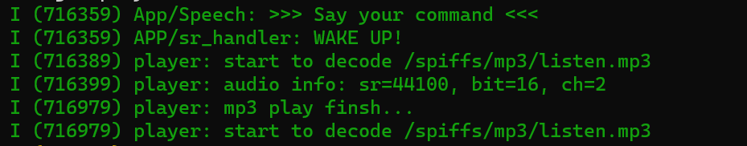

接下来的5s内我们可以说出指定的关键词，ATom-Bot 会进行语音识别并反馈，关键词可以在系统开机时查看：

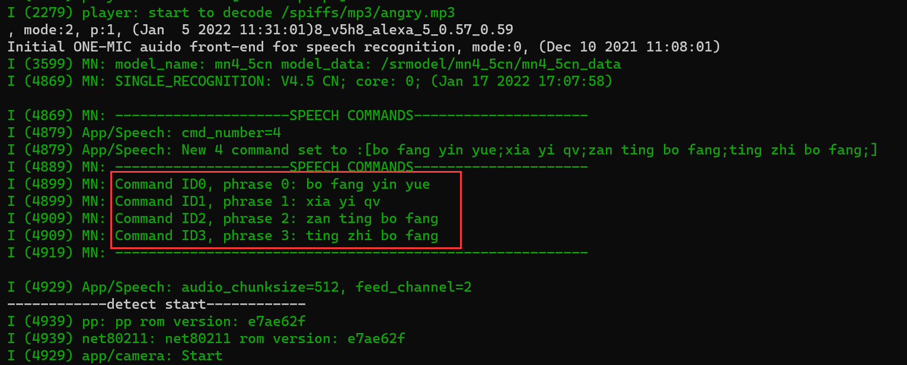

当我们说出指定的命令后，ATom-Bot 会通过扬声器进行回应，同时串口终端会有LOG显示：

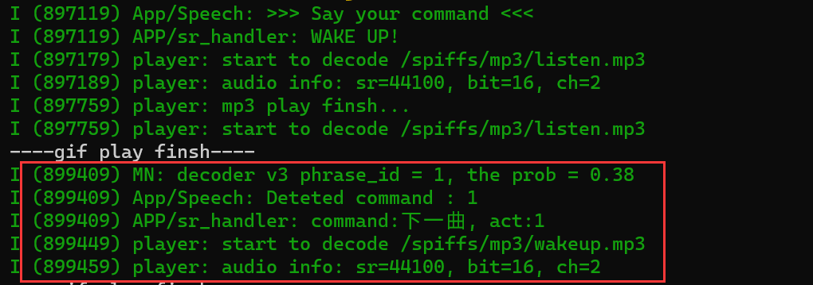

### Camera&Wi-Fi 功能测试

确保代码中使能了以下三个初始化功能。然后进行编译，烧录。

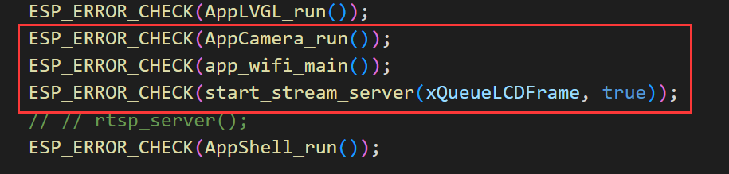

系统默认开机后会将 wi-fi 功能设置为 STA-AP 模式，也就是说我们可以用两种方式（任选其一）连接主板。

1、STA模式连接：

目前的 Wi-Fi 的名称和密码是写死的，需要我们手动修改源码，将下面的 wi-fi 信息修改为家中的路由器名称和密码：

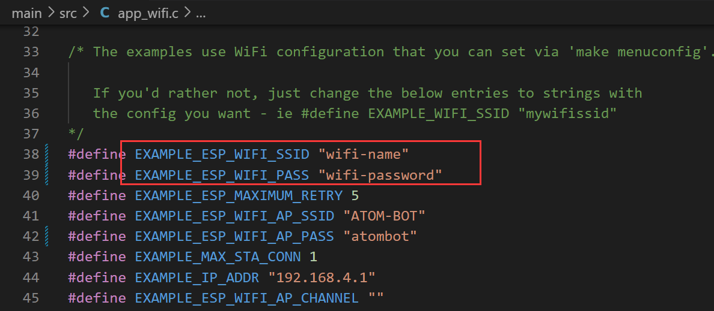

烧录成功后，开机会输出以下的LOG信息，其中包括了ATom-Bot连接成功后获取的IP地址：

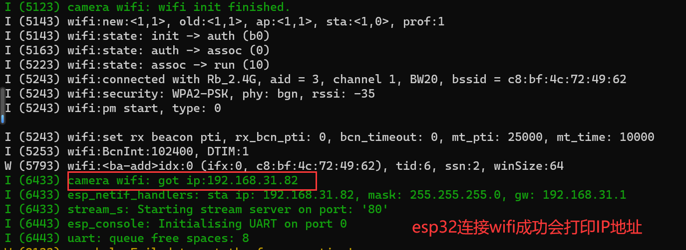

接下来需要打开浏览器，输入上面的IP地址+/stream，例如：`http://192.168.31.82/stream`

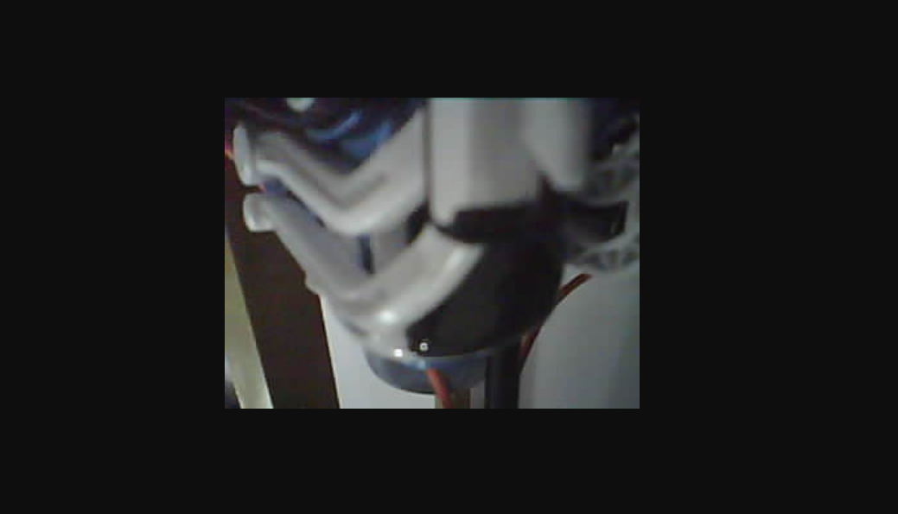

2、AP模式连接：

AP模式意味着 ATom-Bot 自身作为AP热点，我们需要主动去连接它。

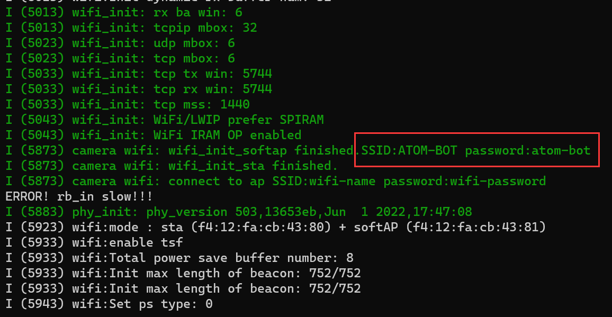

接下来我们主动连接 ATom-Bot 的热点：

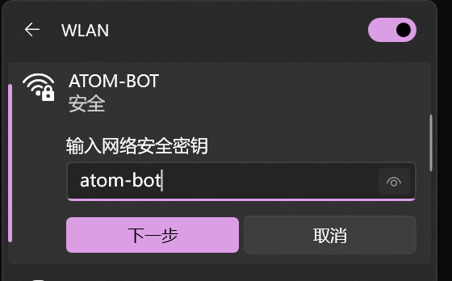

连接成功后，ATom-Bot 的终端会显示以下信息：

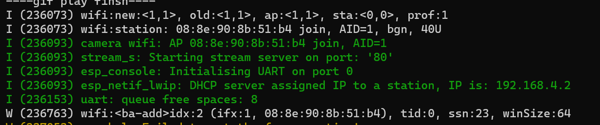

然后我们需要打开浏览器，输入上面的IP地址+/stream，例如：`http://192.168.4.1/stream`

注意：需要连接的IP地址为未加密的IP地址，如下：

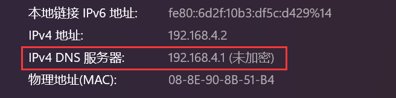

打开网站后就会显示图像信息啦~

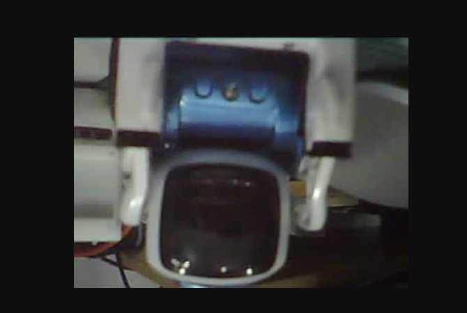

### shell 功能测试

当系统正常运行后，可以在串口终端进行shell交互，方便开发者调试。目前支持以下命令：

* tasks：查看系统的线程信息
* iram：查看片上内存使用状况：max size（已使用的内存堆大小），min size（可使用的内存堆大小）

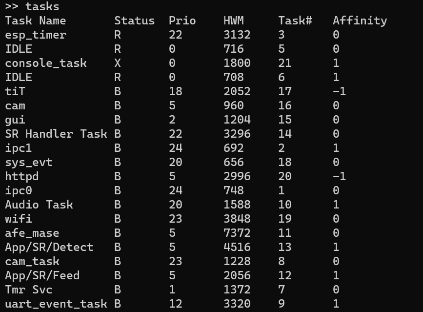

## 项目开发进度

[ATom-Bot软硬件待办列表](https://docs.qq.com/doc/DZmRyVVZGSG9iQnpq)

## 开发中常用指令

```
idf.py menuconfig	(打开图形化配置工程界面)
idf.py -p COMX erase_flash	(擦除整个flash)
idf.py -p COMX flash	(烧录固件(全部资源))
idf.py -p COMX -b 921600 app-flash monitor	(仅烧录app代码部分)(开发常用)
idf.py -p COMX -b 921600 storage-flash monitor	(仅烧录文件系统部分)
idf.py -p COMX -b 921600 flash monitor	(使用指定波特率下载固件并打开串口监视器)
```

