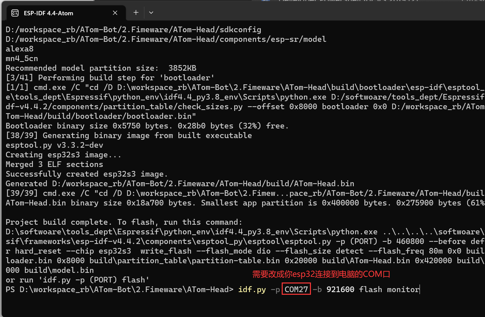

# ATom-Bot-Head Fimeware

## 工程使用说明

本工程为 ATom-Bot 机器人的头部固件源码。

## 硬件结构说明

主控采用 esp32-s3，PCB 采用底板+屏幕拓展板结构，底板与屏幕拓展板采用 fpc 排线相连接。

PCB 主要搭载：摄像头x1、麦克风x1、LCDx1、I2S 音频功放芯片x1。

## 硬件连接示意图


## 软件环境搭建

windows 请自行安装 ESP-IDFV4.4.6 版本，下载链接：[esp-idf=4.4](https://dl.espressif.com/dl/esp-idf/?idf=4.4)

安装成功后可以在 windows 的终端中进行编译/烧录等操作


接下来需要进入`ATom-Head` 目录下，使用命令：`idf.py build` 进行编译


编译通过后，输入 `idf.py -p COMX -b 921600 flash monitor` 命令烧录固件到开发板，同时会在此终端打开串口监视器



## 使用注意事项

TODO

## 项目开发进度

[ATom-Bot软硬件待办列表](https://docs.qq.com/doc/DZmRyVVZGSG9iQnpq)

## 开发中常用指令

```
idf.py menuconfig	(打开图形化配置工程界面)
idf.py -p COMX erase_flash	(擦除整个flash)
idf.py -p COMX flash	(烧录固件(全部资源))
idf.py -p COMX -b 921600 app-flash monitor	(仅烧录app代码部分)(开发常用)
idf.py -p COMX -b 921600 storage-flash monitor	(仅烧录文件系统部分)
idf.py -p COMX -b 921600 flash monitor	(使用指定波特率下载固件并打开串口监视器)
```

