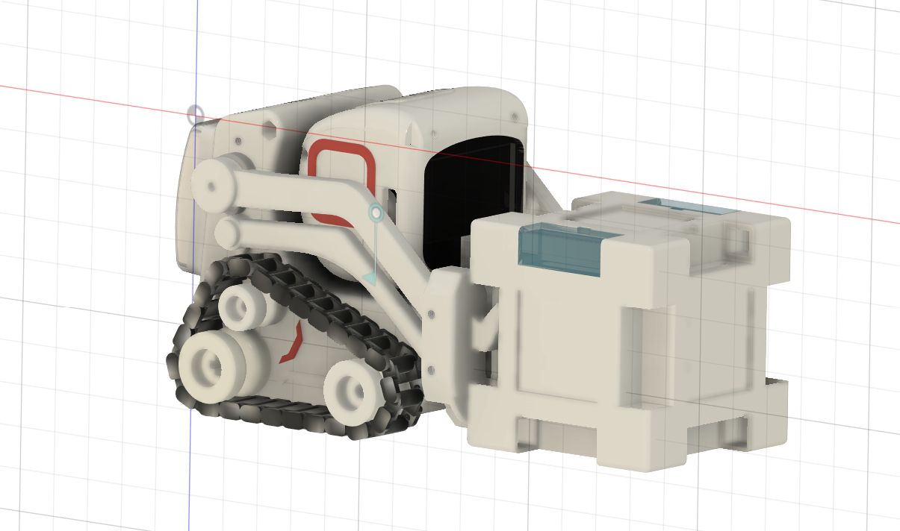

# ATom-Bot 机器人
*喜欢这个项目吗？请考虑给 Star ⭐️ 以帮助改进！*

> A small desktop robot	—小型桌面交互机器人
>
> 本项目是一个桌面级小机器人，外观设计的灵感来源是Anki公司的Cozmo机器人，具备3个自由度（手臂2个、头部一个），使用自己修改的特制舵机支持关节角度回传。通过ESP32的语音唤醒+识别可以实现一些人机交互。
>
> 本项目提供了配套的全套开发资料和对应SDK以供二次开发，SDK使用说明见后文。

机器人主要由头部+底盘两个部分组成

* 头部使用 ESP32-S3 主控担任“大脑”进行UI交互、网络通讯、轻量化AI处理；

* 底盘采用 STM32F103 主控担任“小脑”进行运动控制；

## ATom-Bot-Head 物料说明

[物料说明](https://docs.qq.com/doc/DY0lzSENnbE1SdGRn)

## ATom-Bot-Head 说明

[头部固件使用指南](https://docs.qq.com/doc/DY05KSXNtQ2pnWlF3)

## ATom-Bot-Chassis 说明

[底盘固件使用指南](https://docs.qq.com/doc/DY0NOTWp4Wk1rdlRy)
